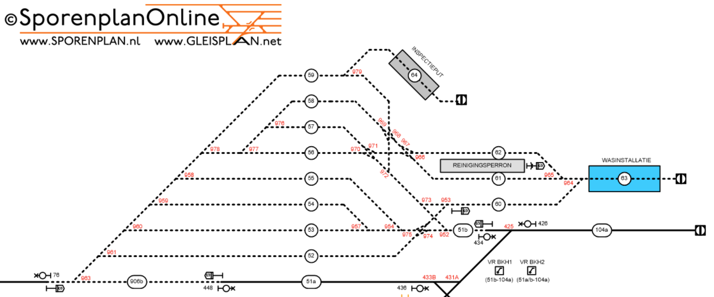

# Kleine Binckhorst
This is a shunting yard near The Hague Central station in the Netherlands, its layout is visualized as follows (source: [SporenPlan online](https://sporenplan.nl/)):

### Details:
The incoming (gateway) track is RailRoad 906a (left bottom corner) which connects to a bumper (`Sein70`) and a switch (`Wissel963`), which is also indicated as 963 in Figure 1. This switch connects to RailRoad 906b. Track 906b in our location is not connected to track 51a, but instead ends with a bumper (`Stootblock906b`).
