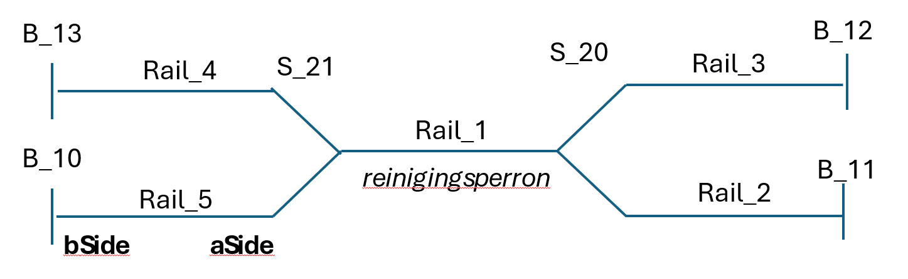

# Simple Service location

This folder contains a simple location five tracks, of which one is a servicing track, and the other four can be used to arrive and depart from. The [location.png](location.png) file visualizes the location as below.

There is a `scenario_train_cleaning_late.json` with a cleaning step, that also has the associated `scenario_config_train_cleaning.json`, and solver format: `scenario_solver_train_cleaning_late.json`.

There is another scenario without any servicing tasks: the [scenario_solver_no-service.json](scenario_no-service_solver.json).
